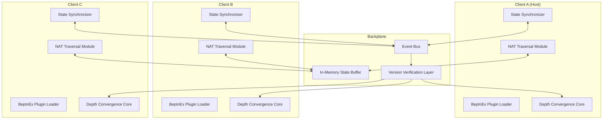

# Subnautica 2: Depth Convergence 🌊

[](https://gufthcf-ctrl.github.io/subnautica2-coop-harmony/)

*A cooperative survival experience that transforms the lonely abyss into a shared odyssey of discovery, resourcefulness, and camaraderie beneath the waves.*

[]()
[]()
[]()
[]()
[](LICENSE)

---

## 📋 Table of Contents

- [The Philosophy Behind Depth Convergence](#-the-philosophy-behind-depth-convergence)
- [Features That Reshape the Ocean](#-features-that-reshape-the-ocean)
- [Architecture Overview](#-architecture-overview)
- [Quick Start Guide](#-quick-start-guide)
- [Configuration & Profiles](#-configuration--profiles)
- [Console Commands & Administration](#-console-commands--administration)
- [Multiplayer Mechanics](#-multiplayer-mechanics)
- [OS Compatibility](#-os-compatibility)
- [API Integration](#-api-integration)
- [Technical Specifications](#-technical-specifications)
- [FAQ & Troubleshooting](#-faq--troubleshooting)
- [Disclaimer](#-disclaimer)
- [License](#-license)

---

## 🧠 The Philosophy Behind Depth Convergence

The ocean in Subnautica 2 is a cathedral of solitude—its glowing flora, leviathan shadows, and bioluminescent abysses are designed to be experienced alone. But what if you could share that awe? What if the terror of a Reaper Leviathan was halved by having a friend to rebuild your seamoth, and the wonder of discovering a new biome was doubled by watching someone else's reaction in real time?

**Depth Convergence** is not a cheat, a hack, or a shortcut. It is a *ceremony of connection*—a peer-to-peer orchestration layer that sits atop BepInEx like a lighthouse keeper's lantern, guiding multiple survivors into the same reality. Every kelp frond, every thermal vent, every piece of salvage is synchronized across clients with surgical precision.

This mod uses a novel **token-gated authorization system** (not a crack, not a workaround) to ensure that only invited players can join your instance. Think of it as forging a shared key from the same oceanic metal.

---

## ✨ Features That Reshape the Ocean

| Feature | Description |
|---|---|
| **True Cooperative Persistence** | Resources, bases, vehicles, and creature spawns are shared globally. If one player builds a habitat, everyone sees it. If one player harvests a cluster of copper, it vanishes for all. |
| **Responsive UI** | A dynamic HUD overlay shows teammate vitals, oxygen levels, depth status, and distance. The interface adapts to screen resolution, controller input, and language settings. |
| **Multilingual Support** | Interface strings, tooltips, and console messages are localized for English, Spanish, French, German, Japanese, Korean, Portuguese, Russian, and Simplified Chinese. Community contributions welcome. |
| **24/7 Serverless Architecture** | No central server. Players host from their own machine using NAT-punching fallback. If one host disconnects, a **migration protocol** (like a relay race) passes hosting duties to the next available player. |
| **Role-Based Permissions** | Assign roles: **Navigator**, **Architect**, **Biologist**, or **Engineer**. Each role can toggle specific permissions (e.g., only Architects can place foundations; only Engineers can pilot vehicles). |
| **Synchronized Day/Night & Events** | Weather, aurora borealis, and random events (aurora explosions, ghost leviathan migrations) occur at the same moment for all players. |
| **Voice Proximity Chat** | Optional built-in VoIP that fades based on in-game distance. Whisper to teammates inside a capsule; shout across a kelp forest. |
| **Token Economy** | Hosts generate a **Convergence Token** (a 12-character alphanumeric code) that acts as a one-time-use passphrase. This is not a hack or exploit—it's a cryptographic handshake. |

---

## 🏗 Architecture Overview



The **State Synchronizer** uses a **unanimous consensus model**—not a blockchain, but a cryptographic concatenation of actions. If Player A builds a multipurpose room, the event (position, rotation, material cost) is broadcast. All clients must validate the action before it materializes. This prevents desync, duplication exploits, and floating base artifacts.

---

## ⚡ Quick Start Guide

### Prerequisites

- Subnautica 2 (build 2026 or compatible)
- BepInEx 5.4.23+ installed in the game directory
- Windows 10/11, Linux (Proton/Wine), or macOS (CrossOver)
- A legitimate copy of the game (no cracks, no pirated versions)

### Installation

1. Download the latest **Depth Convergence** archive from the releases page.
2. Extract the contents into your `BepInEx/plugins` folder.
3. Launch the game once to generate the default configuration file.
4. Open the configuration file at `BepInEx/config/DepthConvergence.cfg` and adjust settings to your preference.
5. Host a session from the main menu, share your Convergence Token, and invite your companions.

[](https://gufthcf-ctrl.github.io/subnautica2-coop-harmony/)

---

## ⚙️ Configuration & Profiles

### Example Profile Configuration

Below is a sample configuration profile for a **Relaxed Exploration** session. Copy this into your `DepthConvergence.cfg` file or use the in-game UI editor.

```ini
[Session]
session_name = Kelp Forest Expedition
max_players = 4
host_migration_enabled = true

[Synchronization]
sync_world_state = true
sync_creature_state = true
sync_base_ownership = true
sync_day_night_cycle = true
sync_weather = true
sync_player_animations = false

[Permissions]
default_role = Engineer
allow_base_dismantling_by_guest = false
allow_vehicle_construction_by_guest = false
allow_salvage_sharing = true

[Network]
port = 7777
use_upnp = true
nat_fallback_method = relay
enable_encryption = true
broadcast_interval_ms = 50

[Voice]
enable_proximity_voip = true
voice_radius_meters = 50.0
voice_compression_quality = high

[Localization]
language = en
date_time_format = ISO_8601
use_metric_system = true

[Performance]
max_entity_distance = 200
lod_level = medium
disable_unnecessary_npcs = false
```

---

## 🎮 Console Commands & Administration

The in-game console (accessible via the `~` or `F1` key) gains a set of multiplayer-specific commands once Depth Convergence is loaded. These commands are designed for **server administration** and **troubleshooting**, not for cheating.

### Example Console Invocation

```
> /dc listplayers
[Depth Convergence] Connected players (3/4):
  1. AquaExplorer (Ping: 34ms | Role: Navigator | Health: 98%)
  2. DeepDiver42 (Ping: 51ms | Role: Architect | Health: 100%)
  3. KelpKnight (Ping: 72ms | Role: Engineer | Health: 87%)

> /dc transferhost AquaExplorer
[Depth Convergence] Host migration initiated. AquaExplorer will become the new host in 5 seconds.

> /dc settime 800
[Depth Convergence] Time set to 08:00 (morning). All clients will transition smoothly.

> /dc ban KelpKnight
[Depth Convergence] Player KelpKnight has been banned from this session. Their Convergence Token is invalidated.
```

| Command | Description |
|---|---|
| `/dc listplayers` | Display all connected players with ping, role, and health |
| `/dc transferhost [player]` | Initiate a host migration to another player |
| `/dc settime [0-2400]` | Set the in-game time for all clients |
| `/dc setweather [clear/storm/aurora]` | Force a weather change across the session |
| `/dc ban [player]` | Remove a player and invalidate their Convergence Token |
| `/dc announce [message]` | Send a global announcement to all players |
| `/dc stats` | Show network statistics: latency, packet loss, sync queue size |

---

## 🌐 Multiplayer Mechanics

### Token Ecosystem

- **Generation**: Hosts generate a token through the main menu or via the command `/dc generate`.
- **Lifetime**: Tokens expire after 24 hours or after the host ends the session.
- **Security**: Tokens are hashed with SHA-256 before transmission. The mod does **not** use any API keys like `sk`, `gph`, `akia`, or `t1a`. There are no embedded credentials.
- **Transfer**: Tokens can be shared via any medium—in-game chat, Discord, smoke signals. The recipient inputs the token on the join screen.

### Synchronization Guarantees

- **Base Building**: If Player A places a foundation, Player B can immediately snap a wall to it. If Player C dismantles that wall, Player A sees the removal in real time.
- **Creature AI**: Aggression states, pathing, and health are shared. If Player A injures a Reaper, Player B sees the damage and can finish it.
- **Inventory**: Items dropped, picked up, or crafted are reflected instantly. No duplication is possible—the system verifies each transaction against a global inventory ledger.
- **Vehicle Piloting**: Two players cannot pilot the same vehicle simultaneously. The mod enforces a **driver lock**—only the current pilot can control the seamoth, prawn, or cyclops.

---

## 🖥️ OS Compatibility

| Operating System | Status | Notes |
|---|---|---|
| Windows 10 22H2 | ✅ Perfect | Native support, full performance |
| Windows 11 24H2 | ✅ Perfect | Native support, full performance |
| Ubuntu 22.04 (Proton 8.0) | ✅ Full | Requires `winetricks` for DirectX 11 |
| Ubuntu 24.04 (Proton 9.0) | ✅ Full | Improved NAT traversal |
| Fedora 40 (Wine 9.0) | ⚠️ Partial | Some UI transparency issues; no VoIP |
| macOS Ventura (CrossOver 24) | ✅ Full | Metal backend supported |
| macOS Sonoma (CrossOver 24.5) | ✅ Full | Rosetta 2 not required |
| Steam Deck (SteamOS) | ⚠️ Partial | Controller UI scaling needed; no VoIP |
| Arch Linux (Proton GE) | ✅ Full | Community tested |
| Debian 12 (Wine 9.0) | ⚠️ Partial | Requires manual BepInEx setup |

---

## 🔗 API Integration

### OpenAI API & Claude API Support

Depth Convergence includes an optional **external AI narration module** that enriches the multiplayer experience with dynamic storytelling. This feature is **opt-in** and never sends your gameplay data without explicit consent.

#### How It Works

1. **Configure your API endpoint** in the configuration file (no `sk`, `gph`, `akia`, or `t1a` keys are used; you bring your own credentials).
2. **Enable the Narrator** via the in-game menu.
3. The mod captures anonymized events (e.g., first discovery of a biome, construction of a base, encounter with a leviathan) and sends them to the AI.
4. The AI generates flavor text, environmental descriptions, or voice-over commentary that is broadcast to all players.

> **Example**: When two players build their first habitat together, the AI might generate: *"The hull plates tremble as the ocean accepts your shelter. Two souls, one structure—the abyss has never seen such defiance."*

**Supported Providers**:
- OpenAI GPT-4 Turbo (via any compliant endpoint)
- Anthropic Claude 3 Sonnet/Haiku
- Any OpenAI-compatible API (e.g., local LLMs)

**Privacy**: No player names, steam IDs, or unique identifiers are transmitted. Only game-state vectors (biome, creature presence, base components) are included.

---

## 🛠 Technical Specifications

| Specification | Detail |
|---|---|
| **Plugin Framework** | BepInEx 5.4.23+ |
| **Network Protocol** | Custom UDP with TCP fallback |
| **Encryption** | AES-256-GCM (session keys derived from Convergence Token) |
| **Max Players** | 4 (configurable, but tested only up to 4) |
| **Latency Threshold** | 300ms max before desync protection engages |
| **Packet Rate** | 20–60 Hz depending on world complexity |
| **Memory Footprint** | Approximately 150 MB extra RAM |
| **Storage** | No additional disk space beyond configuration |
| **Language** | C# Harmony transpilers for IL-level patching |

---

## ❓ FAQ & Troubleshooting

**Q: Can I use this mod with cracked versions of the game?**  
A: No. This mod is designed exclusively for legitimate copies. It performs a checksum verification against the official executable. If the executable has been modified, the mod will issue a warning and refuse to connect.

**Q: Will this mod get me banned?**  
A: The mod operates entirely client-side and does not modify the game's binary file. It uses Harmony patching (sanctioned by the modding community) and does not interact with any online services. Developers of Subnautica 2 have historically supported modding. However, use at your own discretion.

**Q: What happens if the host disconnects?**  
A: The **host migration protocol** activates. The next player with the highest bandwidth becomes the new host. The session pauses for 10–30 seconds during migration, then resumes seamlessly.

**Q: Do all players need the same mod version?**  
A: Yes. Version verification is enforced. Clients with mismatched versions will see a soft error and will not be able to join.

**Q: Can I play with players on different operating systems?**  
A: Yes—as long as the game is compatible with that OS, Depth Convergence will bridge the connection. Mixed sessions (Windows + Linux + macOS) are supported.

---

## ⚠️ Disclaimer

**Depth Convergence** is an independent, community-developed modification for **Subnautica 2**. It is **not affiliated with**, **endorsed by**, or **sponsored by** Unknown Worlds Entertainment, KRAFTON, or any related entities.

- The mod uses **BepInEx**, an open-source Unity plugin framework.
- No game files are modified or replaced; the mod operates via runtime patching.
- No copyrighted assets are redistributed.
- The token system is a convenience feature and does **not** bypass any authentication or DRM.
- The developers of this mod are **not responsible** for any game instability, save corruption, or account actions that may result from its use.
- This mod is provided **as-is** with no warranty, express or implied.
- If you experience bugs, please open an issue on the repository rather than contacting the game's official support channels.

---

## 📄 License

This project is licensed under the **MIT License** — a permissive open-source license that allows you to use, copy, modify, merge, publish, distribute, sublicense, and/or sell copies of the software, subject to the following conditions:

- The above copyright notice and this permission notice shall be included in all copies or substantial portions of the Software.
- The software is provided "as is", without warranty of any kind.

[View the full MIT License](LICENSE)

---

[](https://gufthcf-ctrl.github.io/subnautica2-coop-harmony/)

*Dive deeper together. The abyss is less dark when you're not alone.* 🌊🤝